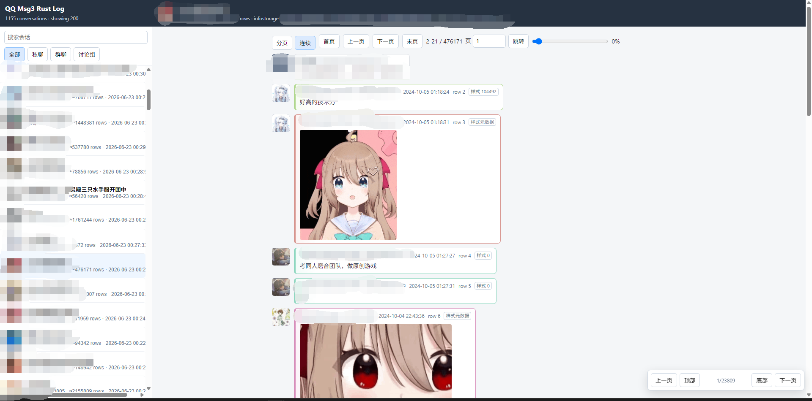

# QQ Analyzer

[](https://github.com/manageryzy/qq-analyzer/actions/workflows/ci.yml)
[](LICENSE)
[](#quick-start)
[](#evidence-policy)

Rust-first local forensic tooling for recovered Windows QQ chat data. The
project focuses on PCQQ Msg3.0 recovery today: credential capture, database
preprocessing, rich-message parsing, InfoStorage metadata lookup, local asset
resolution, and a browser-based log viewer.

<p align="center">
  
</p>

## Highlights

- Rust analyzer entrypoint: `qq_analyzer_rs`.
- Local-only evidence workflow: source QQ databases, media, received files, and
  QQ binaries are treated as read-only.
- PCQQ Msg3.0 rich-text parser with diagnostics for unknown protocol elements.
- InfoStorage-backed conversation names, group/member metadata, avatars, and
  resource indexes.
- On-demand local media serving for matched images, faces, files, voice, and
  video assets.
- Rowid-based web UI for large chat tables with paging, continuous scrolling,
  detail popups, and nested forwarded-message rendering.
- Frida-backed credential capture and QQ codec bridge orchestration from Rust.
- Public-source hygiene: local output, credentials, archives, and generated
  artifacts are ignored by default.

## Evidence Policy

Use this project only for data you are authorized to analyze. Keep source QQ
databases, media, received files, and QQ installation binaries read-only.
Generated outputs belong under `qq-analyzer/output/` and must not be committed.
Database keys, Frida event logs, copied/decrypted databases, exported HTML, and
private account identifiers belong in local ignored files only.

## Quick Start

Build and test the Rust tools:

```bash
cd qq-analyzer/rust-msg3-parser
cargo test --workspace --bins --lib
```

Create private local configuration:

```bash
cp .env.example .env.local
```

Run the typical PCQQ Msg3 flow from the Tencent Files workspace root:

```bash
cd qq-analyzer/rust-msg3-parser
cargo run --bin qq_analyzer_rs -- inventory --root ../..
cargo run --bin qq_analyzer_rs -- capture ensure-frida --root ../..
cargo run --bin qq_analyzer_rs -- capture all --root ../.. --process QQ.exe
cargo run --bin qq_analyzer_rs -- preprocess --root ../.. --prepare-pcqq-dbs --extract-cfb \
  --only Msg3.0.db --only Msg3.0index.db --only Info.db --only Misc.db --only MiscHead.db
cargo run --bin qq_analyzer_rs -- serve --root ../..
```

The service defaults to `http://127.0.0.1:8765/`.

For very large encrypted Msg3 databases, run the Windows executable or wrapper
so snapshot fallback copies stay on the Windows side:

```powershell
.\qq-analyzer\run_windows.ps1 inventory
.\qq-analyzer\run_windows.ps1 capture all --process QQ.exe
.\qq-analyzer\run_windows.ps1 preprocess --prepare-pcqq-dbs --extract-cfb
.\qq-analyzer\run_windows.ps1 serve
```

## Output Layout

- `output/<account>/inventory/`: evidence inventory and discovered paths.
- `output/<account>/credentials/`: normalized credential JSONL records.
- `output/<account>/prepared/pcqq/db/`: prepared readable PCQQ SQLite copies.
- `output/<account>/prepared/pcqq/cfb/`: extracted PCQQ CFB/InfoStorage roots.
- `output/<account>/analysis-md/`: generated database/schema reports.
- `output/<account>/deps/frida/`: cached Frida CLI dependency.

`output/` is ignored and is not part of the public source tree.

## Command Reference

The unified Rust analyzer entrypoint is:

```text
qq_analyzer_rs
```

Common commands:

| Area | Command |
| --- | --- |
| Inventory | `qq_analyzer_rs inventory --root <workspace>` |
| Frida dependency | `qq_analyzer_rs capture ensure-frida --root <workspace>` |
| Credential capture | `qq_analyzer_rs capture all --root <workspace> --process QQ.exe` |
| Preprocess | `qq_analyzer_rs preprocess --root <workspace> --prepare-pcqq-dbs --extract-cfb` |
| Serve UI | `qq_analyzer_rs serve --root <workspace>` |
| DB reports | `qq_analyzer_rs db analyze --root <workspace> --only Msg3.0index.db` |
| Row diagnostics | `qq_analyzer_rs msg3 row-parse --root <workspace> --table <msg3_table> --rowid <rowid>` |
| InfoStorage lookup | `qq_analyzer_rs info label --root <workspace> --info-kind group --id <group-id>` |
| Link check | `qq_analyzer_rs html check-links --input <html-output-dir>` |

Run without arguments to print the full command list:

```bash
cargo run --bin qq_analyzer_rs --
```

## Local Configuration

Copy the public environment template and fill in private local values:

```bash
cp .env.example .env.local
```

Do not commit `.env.local`. It is where local account ids, install paths,
Ghidra bridge paths, and optional tool overrides belong. The Rust binaries also
accept the same values through normal environment variables.

Windows wrappers load `.env.local` automatically:

```powershell
.\qq-analyzer\run_windows.ps1 inventory
.\qq-analyzer\run_rust_service_windows.ps1
```

## Detailed Workflow

Run the unified Rust analyzer entrypoint:

```bash
cd qq-analyzer/rust-msg3-parser
cargo run --bin qq_analyzer_rs -- inventory --root ../..
cargo run --bin qq_analyzer_rs -- capture ensure-frida --root ../..
cargo run --bin qq_analyzer_rs -- capture all --root ../.. --process QQ.exe
cargo run --bin qq_analyzer_rs -- credentials summary --root ../..
cargo run --bin qq_analyzer_rs -- credentials import-key --root ../.. --credential-kind ntqq-sqlcipher --key-hex <hex> --input <db>
cargo run --bin qq_analyzer_rs -- migration audit-python --root ../..
cargo run --bin qq_analyzer_rs -- db analyze --root ../.. --only Msg3.0index.db
cargo run --bin qq_analyzer_rs -- db sample --input ../output/<account>/prepared/pcqq/db/Msg3.0index.db --limit 3
cargo run --bin qq_analyzer_rs -- db inspect --input ../output/<account>/prepared/pcqq/db/Msg3.0index.db
cargo run --bin qq_analyzer_rs -- db export --input ../output/<account>/prepared/pcqq/db/Msg3.0index.db --out ../output/<account>/sqlite-export/Msg3.0index
cargo run --bin qq_analyzer_rs -- db sender-rows --input ../output/<account>/prepared/pcqq/db/Msg3.0.db --sender <uin>
cargo run --bin qq_analyzer_rs -- msg3 row-parse --root ../.. --table <msg3_table> --rowid <rowid>
cargo run --bin qq_analyzer_rs -- msg3 row-probe --root ../.. --table <msg3_table> --rowid <rowid>
cargo run --bin qq_analyzer_rs -- msg3 info-parse --input <info.bin>
cargo run --bin qq_analyzer_rs -- msg3 index-query --input ../output/<account>/prepared/pcqq/db/Msg3.0index.db --conversation-account <uin>
cargo run --bin qq_analyzer_rs -- msg3 export-samples --input ../output/<account>/prepared/pcqq/db/Msg3.0.db --table <msg3_table> --out ../output/<account>/richtext-parser-diff/samples.tsv
cargo run --bin qq_analyzer_rs -- preprocess --root ../..
cargo run --bin qq_analyzer_rs -- serve --root ../..
```

PCQQ classic database preprocessing is also Rust-owned. By default the command
classifies and plans discovered DB work without copying large files. Use
explicit selectors for real preparation:

```bash
cargo run --bin qq_analyzer_rs -- preprocess --root ../.. --prepare-pcqq-dbs --only QQ/Registry.db
```

Encrypted PCQQ SQLite preparation creates a temporary encrypted working copy
under `prepared/pcqq/encrypted-tmp/`. On Windows it first tries the NTFS/ReFS
block-clone API and falls back to a normal file copy if the volume rejects the
clone. The working copy is rekeyed, stripped into `prepared/pcqq/db/`, then
removed. Captured keys are persisted in
`output/<account>/credentials/credentials.jsonl` and reused; key capture is not
repeated for every open. Rust owns two KernelUtil-backed operations through the
cached Frida runner:

- `capture pcqq-query` opens a copied encrypted DB with the saved key and runs
  read-only `CppSQLite3DB::execQuery` calls through QQ's 32-bit codec.
- `capture pcqq-rekey` calls QQ's rekey routine against a copied DB. This works
  for some small PCQQ SQLite databases, but large Msg3 databases can reject
  rekey; do not treat rekey failure as key failure.

Only DBs that validate as non-empty standard SQLite are promoted into
`prepared/pcqq/db/`.

When running from WSL, large QQ database snapshot/copy fallback is refused for
`/mnt/<drive>` paths; run the Windows executable so the fallback copy stays on
the Windows side.

`preprocess` can also run the same Rust rekey orchestration explicitly:

```bash
cargo run --bin qq_analyzer_rs -- preprocess --root ../.. --prepare-pcqq-dbs --rekey-pcqq-dbs --only Msg3.0.db --process QQ.exe
```

The `--rekey-pcqq-dbs` flag is intentionally separate and requires
`--prepare-pcqq-dbs`; default preprocess runs do not attach to QQ or rekey
databases.

Classic QQ OLE/CFB containers can be extracted in Rust:

```bash
cargo run --bin qq_analyzer_rs -- preprocess --root ../.. --extract-cfb --only MiscHead.db --cfb-stream-limit 20
```

Omit `--cfb-stream-limit` for a full extraction after confirming the container
size is acceptable.

Captured Frida `send(...)` events can be normalized without Python:

```bash
cargo run --bin qq_analyzer_rs -- capture normalize-events --root ../.. --input events.jsonl
```

Credentials discovered outside the Rust Frida runner can be imported into the
same JSONL credential store without Python:

```bash
cargo run --bin qq_analyzer_rs -- credentials import-key --root ../.. \
  --credential-kind ntqq-sqlcipher \
  --key-hex <hex> \
  --input <db-path>
cargo run --bin qq_analyzer_rs -- credentials import-key --root ../.. \
  --credential-kind pcqq-sqlite \
  --key-hex <hex> \
  --input <copied-pcqq-db>
```

Use `--credentials <jsonl>` to override the default
`output/<account>/credentials/credentials.jsonl`.

Python migration state is auditable from Rust:

```bash
cargo run --bin qq_analyzer_rs -- migration audit-python --root ../.. --out ../output/python-migration-audit.json
```

Use `--strict` to fail if any Python file is still unclassified. NTQQ
SQLCipher decrypt/export entries are reported as `todo_ntqq` until that future
Rust stage is implemented.

Local-only archived Python scripts may exist under `archive/python-legacy/`.
That directory is ignored and must not be committed to the public source tree.

NTQQ database prefix preparation is Rust-owned. This copies selected NTQQ DBs
and strips the 1024-byte `SQLite header 3` wrapper when the inner SQLite header
is present:

```bash
cargo run --bin qq_analyzer_rs -- preprocess --root ../.. --prepare-ntqq-dbs --only nt_qq/nt_db/nt_msg.db
```

The clean copies are written under `output/<account>/prepared/ntqq/clean/`.
The preprocess report records whether a matching `ntqq_sqlcipher_key`
credential is available. SQLCipher decrypt/export is still a follow-up stage,
but it no longer needs Python for evidence copy or prefix stripping.

Database schema/header analysis is Rust-owned:

```bash
cargo run --bin qq_analyzer_rs -- db analyze --root ../.. --only Msg3.0index.db
cargo run --bin qq_analyzer_rs -- db analyze --root ../.. --input ../output/<account>/prepared/pcqq/db --out ../output/<account>/analysis-md
```

The command writes Markdown reports plus `INDEX.md` and skips exact row counts
for large SQLite files.

SQLite table sampling, inspection, CSV/schema export, and SenderUin row lookup
are also Rust-owned:

```bash
cargo run --bin qq_analyzer_rs -- db sample --input ../output/<account>/prepared/pcqq/db/Msg3.0index.db --limit 5
cargo run --bin qq_analyzer_rs -- db inspect --input ../output/<account>/prepared/pcqq/db/Msg3.0index.db
cargo run --bin qq_analyzer_rs -- db export --input ../output/<account>/prepared/pcqq/db/Msg3.0index.db --out ../output/<account>/sqlite-export/Msg3.0index
cargo run --bin qq_analyzer_rs -- db sender-rows --input ../output/<account>/prepared/pcqq/db/Msg3.0.db --sender <uin> --limit-per-table 3 --max-results 100
```

These commands open databases read-only. `db inspect` emits a JSON table/column
summary, while `db export` writes `schema.sql`, `tables.txt`, and per-table CSV
files under the requested output directory.

Rich-text parser sample TSV export is Rust-owned and requires explicit sample
selectors:

```bash
cargo run --bin qq_analyzer_rs -- msg3 row-parse --root ../.. --table <msg3_table> --rowid <rowid>
cargo run --bin qq_analyzer_rs -- msg3 row-probe --root ../.. --table <msg3_table> --rowid <rowid> --start 0 --len 512
cargo run --bin qq_analyzer_rs -- msg3 info-parse --input <info.bin>
cargo run --bin qq_analyzer_rs -- msg3 export-samples \
  --input ../output/<account>/prepared/pcqq/db/Msg3.0.db \
  --table <msg3_table> \
  --known-row <msg3_table:rowid> \
  --out ../output/<account>/richtext-parser-diff/samples.tsv
```

MsgIndex inspection is Rust-owned and supports account, LIKE, and FTS MATCH
queries without hardcoded local samples:

```bash
cargo run --bin qq_analyzer_rs -- msg3 index-query \
  --input ../output/<account>/prepared/pcqq/db/Msg3.0index.db \
  --conversation-account <uin> \
  --like '%keyword%' \
  --match <fts-query>
```

InfoStorage label/profile inspection is available through the Rust CLI:

```bash
cargo run --bin qq_analyzer_rs -- info label --root ../.. --info-kind group --id <group-id>
cargo run --bin qq_analyzer_rs -- info group-profile --root ../.. --group <group-id>
cargo run --bin qq_analyzer_rs -- info group-members --root ../.. --group <group-id> --uin <member-uin>
cargo run --bin qq_analyzer_rs -- info contact-profiles --root ../.. --uin <contact-uin>
cargo run --bin qq_analyzer_rs -- info stream --root ../.. --stream Group/Basic.db --uin <entry-name>
```

Use `--input <Info.db-root>` and `--credentials <credentials.jsonl>` to override
the defaults under `output/<account>/prepared/pcqq/cfb/Info.db` and
`output/<account>/credentials/credentials.jsonl`.

Generated HTML link checks are Rust-owned:

```bash
cargo run --bin qq_analyzer_rs -- html check-links --input ../output/<account>/html-recovered
```

The command writes `dead_links_report.json` by default and exits non-zero when
local dead links are found.

Rust can also own the Frida CLI attach loop and write captured events directly:

```bash
cargo run --bin qq_analyzer_rs -- capture ensure-frida --root ../..
cargo run --bin qq_analyzer_rs -- capture all --root ../.. --process QQ.exe
cargo run --bin qq_analyzer_rs -- capture pcqq-query --root ../.. --input <copied-pcqq-db> --sql "SELECT count(*) FROM sqlite_master" --process QQ.exe
cargo run --bin qq_analyzer_rs -- capture pcqq-rekey --root ../.. --input <prepared-copy.db> --process QQ.exe
```

Use `--pid <pid>` instead of `--process <name>` for an exact target. Use
`--events <jsonl>` to choose the event log, `--credentials <jsonl>` to choose
the normalized credential store, and `--no-import` to only record raw Frida
events. If `--frida <path>` is omitted, Rust downloads and caches the matching
official `frida-inject` release asset under `output/<account>/deps/frida/`.
Windows and WSL use the Windows executable; native Linux uses the Linux
executable. Unsupported hosts must pass `--frida <path>` explicitly.
This removes the Python hook runner from the main workflow; Frida itself
remains the external instrumentation backend.

Asset basename matching is Rust-owned and scans only explicitly supplied roots:

```bash
cargo run --bin qq_analyzer_rs -- assets basename-match \
  --unresolved ../output/<account>/asset-audit-allcfb/unresolved_image_rows.tsv \
  --asset-root ../../<account>/Image/C2C \
  --asset-root ../../<account>/Image/Thumbnails \
  --out ../output/<account>/asset-audit-allcfb
cargo run --bin qq_analyzer_rs -- assets c2c-md5-hits \
  --unresolved ../output/<account>/asset-audit-allcfb/unresolved_image_rows.tsv \
  --asset-root ../../<account>/Image/C2C \
  --asset-root ../../<account>/Image/Thumbnails \
  --asset-root ../../<account>/Image/PicFileThumbnails \
  --out ../output/<account>/asset-audit-allcfb/c2c_md5_hits.tsv
cargo run --bin qq_analyzer_rs -- assets candidate-rules \
  --input ../output/<account>/asset-audit/image_asset_candidates.tsv \
  --asset-root ../../<account>/Image/Thumbnails \
  --asset-root ../../<account>/Image/PicFileThumbnails \
  --asset-root ../../<account>/Image/Group/thumbnail \
  --asset-root ../../<account>/Image/C2C \
  --out ../output/<account>/asset-audit/candidate_rules.json
```

Windows side:

```powershell
.\qq-analyzer\run_windows.ps1 inventory
.\qq-analyzer\run_windows.ps1 preprocess --prepare-pcqq-dbs --only QQ/Registry.db
.\qq-analyzer\run_windows.ps1 serve
.\qq-analyzer\run_rust_service_windows.ps1
```

The service defaults to `http://127.0.0.1:8765/` and keeps the existing API
shape:

- `/api/status`
- `/api/conversations`
- `/api/conversation_detail`
- `/api/conversation_details`
- `/api/messages`
- `/api/message_detail`
- `/asset/...`

Useful parser checks:

```bash
cd qq-analyzer/rust-msg3-parser
cargo run --bin parser_group_selftest -- --root ../.. --table <group_table>
cargo run --bin parser_all_sample_selftest -- --root ../..
cargo run --bin parser_coverage_check -- --root ../.. --table <msg3_table> --limit 500
```

`parser_group_selftest` intentionally requires explicit table selectors. The
older `msg3_row_parse` and `msg3_row_probe` bins remain as compatibility
wrappers, but the unified `qq_analyzer_rs msg3 row-parse/row-probe` commands
are the preferred entrypoints.

## Documentation

Formal implementation notes are tracked under `docs/`:

- `docs/architecture.md`
- `docs/coding-standards.md`
- `docs/ghidra-verification.md`
- `docs/msg3.md`
- `docs/txdata.md`
- `docs/infostorage.md`
- `docs/assets.md`
- `docs/web-ui.md`
- `docs/migration-map.md`

Raw Ghidra decompile dumps, ad hoc probes, and generated reports remain in
`output/` and are not committed as source.

## Python Status

Python is legacy-only. It may be used as a temporary compatibility reference
while equivalent Rust capture/preprocess functionality is implemented, but it
must not be extended as the long-term analyzer path.

Frozen legacy categories:

- Existing Frida/key-capture scripts used only as migration references.
- Old Python service/export helpers.
- One-off inspection, audit, and comparison probes. These are not migrated by
  default; only durable analyzer behavior should move into Rust.

Do not add new long-lived parser behavior to Python unless it is explicitly a
temporary probe. New analyzer behavior, including credential capture, should be
Rust-first.

Run `qq_analyzer_rs migration audit-python` after adding, moving, or retiring
Python scripts. The report classifies files as Rust-replaced, NTQQ TODO,
legacy probe, or unclassified.

The default Windows wrapper now targets the Rust analyzer:

```powershell
.\qq-analyzer\run_windows.ps1 <qq_analyzer_rs args>
```

Rust tools can also be launched directly through:

```powershell
.\qq-analyzer\run_rust_tool_windows.ps1 parser_group_selftest --root .
```

The Windows Python wrappers are kept only for local, ignored migration archives:

```powershell
.\qq-analyzer\run_windows.ps1 legacy-python <qq_analyzer.py args>
.\qq-analyzer\run_windows_script.ps1 <legacy-script-under-qq-analyzer> [args...]
```

Both wrappers resolve scripts from a local `archive\python-legacy` directory
when needed. That directory is ignored and not part of the public source tree.
`run_windows_script.ps1` is only for historical one-off probes and migration
comparison. It is not a main analyzer entrypoint.

## Legacy NTQQ Database Tooling

The final target is Rust-only. Manual key storage, Frida event normalization,
PCQQ preprocessing, NTQQ prefix preparation, and the service path are
Rust-owned. Historical Python NTQQ SQLCipher helpers remain only as
compatibility/reference scripts while their remaining decrypt/export behavior is
moved into Rust commands.

`qq_analyzer.py` still contains earlier NTQQ SQLCipher helper commands for
scan/prepare/decrypt/inspect/export. They are legacy support and are not the
current Msg3 web-analysis path. The Rust `qq_analyzer_rs preprocess` command is
the replacement integration point for inventory, DB classification, safe copy,
header stripping, and catalog reporting. Generic SQLite inspect/export is
replaced by `qq_analyzer_rs db inspect` and `qq_analyzer_rs db export`. NTQQ
SQLCipher decrypt/export is intentionally a future Rust TODO. The old
`analyze_pcqq_databases.py` schema/header report flow is replaced by
`qq_analyzer_rs db analyze`; the old `check_html_dead_links.py` flow is
replaced by `qq_analyzer_rs html check-links`.

Database keys must not be hard-coded in scripts or committed notes. Read keys
from environment variables, key files, or prompts.

## Public Release

The public repository is WTFPL licensed; see `LICENSE`. Publish from a
clean-history branch such as `public-main`, not from a local development branch
that may contain old private history.

Never commit account ids, local absolute paths, database keys, Frida event
logs, copied/decrypted databases, generated HTML, media exports, or `output/`.
Local-only archives may exist under `archive/`; the directory is ignored and is
not part of the public source tree. The only intended committed image asset is
the manually reviewed README screenshot under `docs/screenshot.png`.

Create or refresh a one-commit public snapshot:

```bash
tree=$(git rev-parse HEAD^{tree})
commit=$(printf '%s\n' 'Public clean snapshot' | git commit-tree "$tree")
git branch -f public-main "$commit"
git rev-list --count public-main
```

The final count should be `1` for a single-snapshot public branch.

Check that private local paths are ignored and not tracked:

```bash
git ls-files archive .env.local .codex output
git check-ignore -v \
  .env.local \
  archive/python-legacy/example.py \
  archive/native-legacy/example.cpp \
  output/example \
  output/example/credentials.jsonl \
  output/example/events.jsonl
```

`git ls-files ...` should print nothing. `git check-ignore -v ...` should show
the `.gitignore` rule responsible for each private path.

Put private scan patterns in a local ignored file so account ids, usernames,
email fragments, and host paths are never copied into public documentation:

```bash
cat > .private-scan-patterns <<'EOF'
<account-uin>
<private-group-uin>
<private-contact-uin>
<windows-user>
<private-email-fragment>
<absolute-workspace-path-regex>
<qq-install-path-regex>
EOF

git grep -n -I -E -f .private-scan-patterns \
  -- . ':!Cargo.lock' ':!.private-scan-patterns'
```

Scan committed source for embedded keys and common token formats:

```bash
git grep -n -I -E \
  '(key_hex\s*[:=]\s*['"'"'"][0-9a-fA-F]{16,}['"'"'"]|BEGIN (RSA|OPENSSH|EC|PRIVATE) KEY|AKIA[0-9A-Z]{16}|ghp_[A-Za-z0-9_]{30,}|sk-[A-Za-z0-9]{20,})' \
  -- . ':!Cargo.lock'
```

Check the public branch tree directly:

```bash
git ls-tree -r --name-only public-main | rg \
  '(^archive/|\.env\.local|\.codex|output/|credentials\.jsonl|events\.jsonl|\.db$|\.sqlite|\.exe$|\.dll$|\.jpg$|\.bmp$|\.gif$|\.webp$|\.png$)' |
  rg -v '^docs/screenshot\.png$'

git grep -n -I -E -f .private-scan-patterns \
  public-main -- . ':!Cargo.lock' ':!.private-scan-patterns'

git grep -n -I -E \
  '(key_hex\s*[:=]\s*['"'"'"][0-9a-fA-F]{16,}['"'"'"]|BEGIN (RSA|OPENSSH|EC|PRIVATE) KEY|AKIA[0-9A-Z]{16}|ghp_[A-Za-z0-9_]{30,}|sk-[A-Za-z0-9]{20,})' \
  public-main -- . ':!Cargo.lock'
```

These commands should print nothing except intentional review output from your
shell tooling. Also review committed screenshots manually before publishing.
Run the normal validation before refreshing `public-main`:

```bash
cargo fmt --all -- --check
cargo test --workspace --bins --lib
git diff --check
```

## Ghidra

Target binary for behavior verification is:

```text
<QQ_INSTALL_DIR>\Bin\IM.dll
```

Use the local Ghidra MCP service at `http://127.0.0.1:8089`. Rules and evidence
recording expectations are in `docs/ghidra-verification.md` and
`GHIDRA_MCP_RULES.md`.
